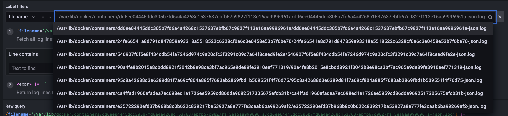

# Report on monitoring
## Local test
In order to test locally I cloned [loki](https://github.com/grafana/loki) repo, and ran `docker-compose up` in `./production` directory.
## Screenshot
Created docker-compose with grafana and my app

Here's logs from my app

Here I can change what container log I want to see using its ID

